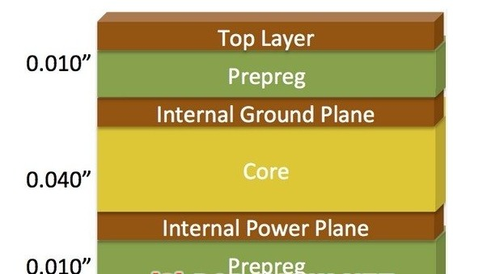
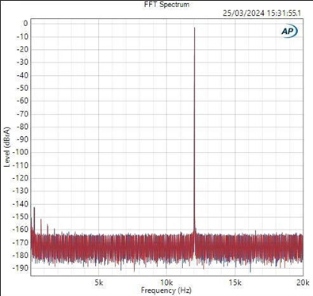
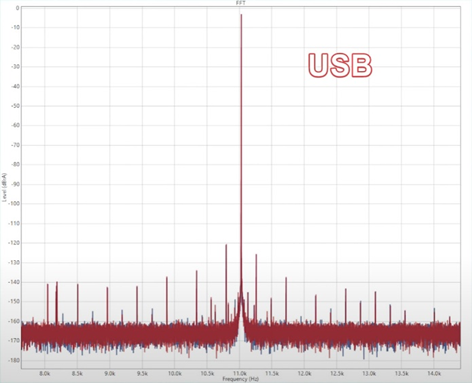
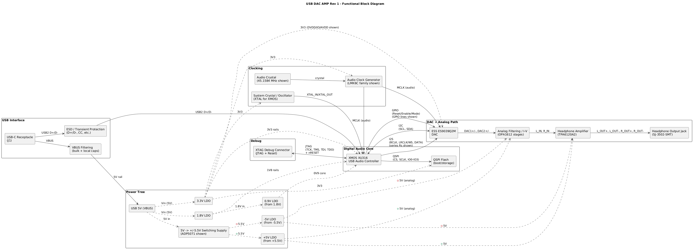
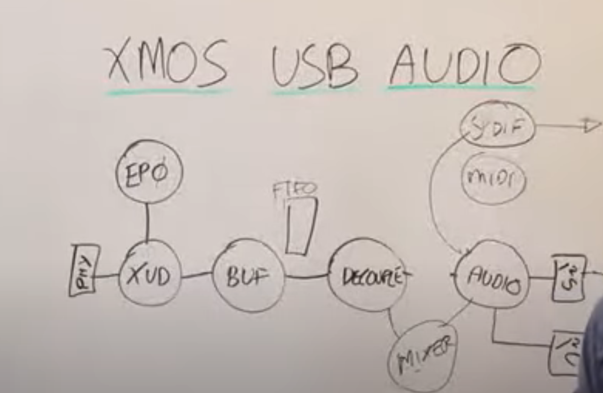

# Headphone DAC/AMP Overview
The following is a general system overview of an XMOS DAC & TPA6120 AMP
## Abstract

## 1. Introduction

###  1.1 Background & Motivation
High-fidelity audio has become increasingly difficult to access for the average user, as most integrated digital-to-analog converters (DACs) in phones and laptops are limited to 16-bit resolution and a 44.1 kHz sampling rate, which is only marginally sufficient for modern high-resolution audio standards. At the other end of the spectrum, systems capable of 24-bit resolution and sampling rates above 98 kHz are often prohibitively expensive and rely on external power sources, making them bulky and inconvenient for portable use or integration into an already crowded home audio setup.

The goal of this project is to demonstrate that both high resolution and high sampling rates can be achieved in a compact, affordable system. While a moderate amount of theoretical information explaining how a DAC-amplifier system functions is available online, practical guidance regarding component selection, layout considerations, IC integration, and signal-path design remains limited. This project therefore also aims to serve as a technical resource for future designers interested in high-fidelity audio systems, reducing the barrier to entry and simplifying the development process. 

###  1.2 Project Goals

The primary goal of this project is to design, implement, and test a compact, high-fidelity DAC-amplifier that is cost-effective relative to comparable commercial products. The system will convert digital audio data into a clean, low-noise analog output and will support a wide range of headphones and IEM's with impedances between 10 Ω and 300 Ω. All operation will be powered exclusively through a USB-C 2.0 interface, eliminating the need for any external power supply, and output to a 3.5mm balanced jack.    

The following requirements should be met:
* 24-bit resolution at a 192kHz sampling rate
  * reasonable spec for "Hi-Fi". Higher is better.
* USB-C Input
* 3.5mm balanced output
* 10Ω to 300Ω capable headphone interfacing
* Adjustable gain for a variety of headphone / IEM models

###  1.3 Scope of Work

This project encompasses the design considerations, system implementation, component selection and placement, 
assembly, and performance testing of a compact, USB-powered DAC-amplifier. Design considerations include evaluating suitable DAC 
and amplifier architectures, power constraints and noise mitigation techniques. Implementation involves translating the schematic into a functional 
PCB layout, with careful attention to grounding, signal routing, and isolation between digital and analog sections. Component placement is
optimized to minimize interference and ensure signal integrity, while still maintaining a compact form factor. Assembly includes PCB fabrication,
component population, and hardware integration. Finally, performance testing is conducted to evaluate signal-to-noise ratio, total harmonic distortion, 
frequency response, and overall system functionality under real-world operating conditions. 

###  1.4 Report Organization

This report will be structured in order of operations; from sources to testing. Each point will have related subpoints that further section off specific concepts to keep the paper concise. 

## 2. Literature Review

### 2.1 DAC/AMP Design Principles & Solutions

#### Ladder DAC
Given that the initial goal of the project was creating a custom solution, the first step was to look at custom DAC topologies. These are often relatively difficult to implement, but one of the simplest versions of this is the Resistor Ladder DAC topology. A Ladder DAC uses a series of resistors arranged in a network to convert digital signals into analog voltages. Each bit of the digital input controls a switch that connects either a reference voltage or ground to the resistor network. The combined effect of the resistor values and switch positions produces a stepped analog output proportional to the digital input. The limitation of these Ladder DACs is that they are heavily dependent on the accuracy across all of the resistors within the network. Any variance can induce distortion into the output, which is not acceptable for the needed application.

### 2.2 Related Designs

Here us a currently available DAC utilizing an xmos and sabre DAC listed at $200 https://www.amazon.com/S-M-S-L-MQA-ES9039Q2M-Bluetooth-Decoder/dp/B0CJM6QFVF

Additionally the chips we are planning on using are available on their own application boards direct from china. Before going very far with the design, we purchased these boards and tested them together to make sure they could work.
XMOS to I2S Bridge: https://www.aliexpress.us/item/3256807335069219.html?spm=a2g0o.order_list.order_list_main.86.603618028uubqz&gatewayAdapt=glo2usa
ES9029Q2M DAC: https://www.aliexpress.us/item/3256808303929213.html?spm=a2g0o.order_list.order_list_main.81.603618028uubqz&gatewayAdapt=glo2usa

Additionally, we found a schematic online which contained the XU316 and seemed to be a later revision to the decoder board that we had purchased

## 3. Theory

### 3.1 CT Vs DT Audio
The purpose of a DAC is to convert a binary string into an analog signal. When a time component is added into the scope, the audio has to be sampled at a certain rate and turned into a continuous-time signal rather than a discrete-time signal. According to the Nyquist sample ling theorem, the signal should be sampled at twice the maximum sampled frequencies, as shown in equation one. This minimum sampling frequency, although is enough to recreate the signals, is not enough to recreate the quality of the original continuous-time signal. Even outside of the Nyquist sampling frequency, 40kHz, Aliasing can still occur if there are frequencies that appear outside of the bandwidth of human hearing, so for a more accurate representation of a signal, we sample higher than the minimum sampling frequency.

 $$F_s > 2F_{max}$$  
 Equation one: Nyquist Sampling Theorem 

### 3.2 DSP Components
In order to get a signal that the DAC can read, there needs to be a supporting chip that can talk to the host device and has a single master-out line for the DAC to decode. A DSP (digital signal processing) device is needed in order to do this. First, a stable clock must be a part of the communication protocol in order to avoid jitter, the device needs to be able to set the aforementioned sampling frequency with the host device, and optionally, the DSP device needs to be able to change the dB of specific signals in order to introduce a digital equalizer. 

### 3.4 Grounding Strategies

When designing PCBs, a common practice is to often design around the idea of splitting up the grounds used for analog and digital. This is done in very low noise or extremely high frequency applications. The theory behind the separation of these ground connections is that you are controlling the path of the signal's control current, preventing the return current of a high frequency signal from inducing EMI. Many ICs actually have separate pins for analog and digital grounds. Any design utilizing these separated grounds still requires that the grounds be connected at a single point, preferably near the power input of the circuit. This is an old and common practice in these designs, but based upon our research, this is actually an outdated practice.

Theory and practicality require each other to work in many cases. In this case, while in theory an analog and digital ground separation may reduce conducted emissions, in practice the split of these grounds causes inconsistent, long, and winding return paths. The added length or deviations of these return paths actually increase the conducted emissions across the circuit, worsening any noise or signal integrity issues. in lower frequency designs (below about 20kHz), these ground separations make more sense as the current return path is wider, therefore risk of interference is increased. But in higher frequency designs, the analog and digital grounds should not be separated but instead combined, and alternative grounding methods be used.

The following interview is a discussion with Rick Hartley, a prominent figure in the RF PCB Design world. In this interview, Rick discusses the split of a ground plane, and whether it should be implemented. While during the discussion Rick mentions that there are use cases for both, he also states that his first fix in nearly every situation involving noise or conducted emissions is removing the split planes. Rick then goes on to show a presentation slide with a joke he likes that I think sums up the stance he gives on the technique of splitting grounds. "What do we call an engineer who splits their grounds? A customer!" For reference, this joke comes from a conducted emissions debugging specialty company. 
https://youtu.be/vALt6Sd9vlY

Instead of Splitting the grounds in our design, we have chosen to combine them and focus on maintaining ground everywhere throughout the board. The primary thing we chose to do was implement a Ground plane on layer 2 of the PCB. This ground plane was implemented to serve as a solid and continuous return path which served as shielding between signals and other nets routed on the other side of the plane. This copper plane is standard practice when implementing a layer stackup with noise reduction in mind. This ground plane provides an unbroken path underneath each trace for its current to return through. This, combined with the physical seperation of tha analog and digital stages on the PCB, allow for the analog and digital return currents to not interfere with eachother. This reduction of interference is the exact goal of implementing a split ground scheme, but it is more easily acheivable in our application with this unbroken grounding plane strategy.

This plane being the center of our layer stackup allows us to finish determining the board stackup. Layer 1 will be our topside component and signal layer, and Layer 2 will be that unbroken ground. Because we do not have to worry about Layer 3 inducing significant noise to the components on Layer 1, we can choose to dedicate that as a power layer to make the distribution of power easier. Layer 4 can serve as a passthrough signal layer, but it is important to note that critical signals on the board are routed to specifically avoid being passed through a via to Layer 4. This is because the via passes through the ground plane and brings the signal close to the power lines of the board, which is a significant risk for noise. Being routed through the ground plane is reserved for low risk signals such as digital signals in the sub 750 kHz range. With that, we have our completed board stackup.

## 4. System Architecture

### 4.1 Design Requirements
For the purposes of the DAC AMP design, we are focusing on the base requirements and working through what we need to use for the device to meet those requirements. To begin with, our requirements are to have good quality audiophile grade output from USB. The output we would need to use to get this audio quality was unknown, so we began with some research on that. 

According to many sources that we could find, the vast majority of users could not differentiate any audio quality difference between any signal qualities above 16-bit and 96KHz response rating. For real world devices, studio grade equipment still attempts to produce truly “Lossless” audio by producing a signal with a 32-bit depth and a 768KHz sampling rate in order to get as close as possible to the reference waveform. When looking at the market of these studio products, they are often for musicians or those who rely on audio for their work. This means that our “acceptable quality range” is from that 16-bit 96KHz quality to 32-bit 768KHz. We do not need the extra difficulty of reaching that lossless range as we do not intend to use this device in a studio environment, so reaching the top end of the range is not a priority. This range puts us within the USB Audio Class 2.0 range, which also affects which specific ICs we can use for interfacing. 

The next step was to research how to get this signal out from the computer into the headphones or IEMs being used for playback. The overall audio stage understanding that we have coming in is that an there are two core steps; the Digital to Analog Conversion to produce the signal, and the Amplification of incoming Audio Signal in order to feed it to the output device. Having this understanding coming in aided in narrowing down our approach. The amplifier has is its own analog design considerations based on the expected load, so for now we will be limiting our view to the Digital to Analog Conversion stage. Our first step was to see what was available as an IC already. On supplier websites, there are several ICs that handle a full USB to Audio signal conversion in the chip. These chips all fall outside of our acceptable bounds of audio quality though. The sampling rate that the chips seem to be limited to is 48KHz, and there are very few Active chips available, with most options being obsolete or Not for New Designs.

If we cannot handle the full USB interfacing and the conversion Digital Audio to Analog Audio within a single IC, we can distribute the roles. With this setup, there would be an initial IC which accepts the USB Audio Class 2.0 input, and this IC would act as the USB interface while outputting a digital audio signal. This leads us into the main design consideration that will affect the types of devices we can use; the communication protocol which we use for the audio interfacing. There are a couple of different options here. The most familiar option would be a standard microcontroller protocol such as SPI, or Serial Peripheral Interface. This has the advantage of being more widely documented and supported, but has the drawback of being more general purpose. SPI is a high speed bus protocol meant to contain multiple devices on the same bus, with lots of features to prevent data collisions and proper data reliability. None of these benefits to SPI matter for our application, as the plan is to have minimal devices on board. 

If the general-purpose protocols don’t benefit our application, then we can shift to looking at more purpose built protocols. One available protocols we could use is known as S/PDIF, or the Sony / Phillips Digital Interface. This protocol has the advantage of being able to communicate over a single coaxial input and being more robust to send out at a range. It is a protocol which microcontrollers can support, but parts are a bit more expensive relative to other options and the input is limited to 24-bit 192KHz. This itself shouldn’t be a dealbreaker for use of S/PDIF, and the ability to send output of the signal through an optical cable is a very big advantage. A large downside to S/PDIF is that it does use that single communication line which allows it to be sent over optical. The clock signal for communication is internal to the data being sent through the wire, and the receiving side needs to get the clock signal using a PLL. This adds extra overhead and design complexity for a situation where the long-distance communication benefit is not needed.

There is another robust Digital Audio interface available known as I2S, or Inter-Integrated Circuit Sound. This protocol was developed specifically for audio interfacing and can support full speed audio up to any point within our requirements range. I2S has the perk of using a clock to send bits and synchronize the information that needs to be sent to DAC. This clock can be configured such that a high frequency, low jitter, low phase noise clock can be implemented into the I2S bridge, which when implemented, results in a similar high performance I2S signal with little to no harmonics as shown in a test below from forum.headphones.com, where the only harmonic present is the output frequency of the speakers. The figure below shows the same output through USB. The issue with using USB is that the system receives bursts of information every millisecond or so, rather than receiving a bit per stable cycle. This results in non-uniform sampling that can cause noise. Due to the benefits that I2S gives in our small scale implementation, we will be going forward with it as the core of our design. 

### 4.2 Block Diagram
Figure X shows the block diagram of the system. The design uses the XMOS XU316 as a digital signal processing and interface device to convert USB audio data into an I²S data stream. This I²S stream is then processed by the ES9039 32-bit digital-to-analog converter (DAC), which produces a high-fidelity analog audio signal. The analog output is subsequently amplified by the TPA6120 headphone amplifier to drive the headphone load.  

Supporting power architecture is implemented using multiple low-dropout regulators (LDOs) to supply the required voltage domains. Dedicated LDOs provide regulated 3.3 V, 1.8 V, and 0.9 V rails for the digital and mixed-signal components. The headphone amplifier is powered by a differential supply derived from a 5.5 V rail using the ADP5071 and buffered using LDO's. An initial design utilizing a ±12 V differential supply was evaluated; however, concerns regarding excessive output power and the risk of overdriving headphones led to the selection of a lower-voltage differential supply.  

The XMOS XU316 requires multiple clock sources, including an external master clock and an I²S clock, to ensure accurate audio timing and low jitter performance. Additionally, an external boot memory device is required for firmware storage, which is provided by the W25Q32JV QSPI flash memory.

   
 Figure X: Block Diagram of system

### 4.3 Component-Level Architecture
The system works as follows when viewing the flowchart; USB to a device connects to the board VIA USB-C and communicates to the XMOS through USB. The XMOS converts the audio signal from USB to I2S. This I2S signal comes into the ES9039, where a 32 bit word is turned into an analog voltage, where each bit of the word represents a voltage, and the sum of those voltages gives an aproximation of the sampled audio. This now analog signal is then sent to a 2-pole lowpass filter using the OPA1612 in order to remove any frequencies that are not present in human hearing (>20kHz). This filtered frequency is then sent to the TPS7A3301, where the signal is amplified to output to a headphone through a 3.5mm TTRS jack.

## 5. Circuit Design

### 5.1 Schematic Overview
The schematic design is implemented in KiCad due to its versatility and low barrier to entry. In addition to its accessibility, KiCad provides robust support for hierarchical schematic design, which is critical for enabling a synchronous and collaborative development workflow. To support multiple contributors working on different subsystems simultaneously, the project is managed using Git in conjunction with hierarchical schematics. 

Each major functional block of the system is implemented as an individual hierarchical subschematic, allowing for modular development, improved readability, and simplified version control. The functional blocks are organized as follows: 
* USB Input: XMOS, QSPI Flash, and USB-C header
* Audio rails: Differential powersupply resides aswell as supporting LDO's
* General power: 3.3V, 1.8V, and 0.9V LDO's
* DAC: ES9039 and supporting parts
* Headphone AMP stage: OPA1612, TPA6120 headphone AMP, and supporting parts
* Clocking: System and audio clocks
* Debug: XTAG debug connector that will connect to the XMOS

All subschematics are connected through hierarchical labels to a single root schematic, which defines the system-level interconnections. Within each subschematic, components are grouped into clearly defined blocks to reflect functional signal flow. This hierarchical organization improves schematic readability, supports collaborative development, and provides a clear mapping between system-level architecture and circuit-level implementation.

### 5.2 Component Selection

In order to go with an I2S setup, we would need to utilize a specific device to convert from the USB 2.0 signal to the I2S digital audio signal. A search for a simple USB to I2S bridge IC shows several options from Silicon Labs, such as the CP2615.The two core reasons these ICs would not work for us though is that they are all obsolete, and none of them support the full USB Audio Class 2.0 that would be needed to get the HiFi signals we want. Because they were obsolete, our next step is to investigate the recommendation for new designs, which in our case was EFM8UB20F32G. This new device is an entire microcontroller with many peripheral options, but there was not much information on its application as an I2S bridge easily available, and we could not find any commercial devices which utilized it.

When researching commercial topologies, there were 4 main microcontroller brands which are used. Qualcomm is very common to see in available products, but that is due to these SOCs being easily able to run the Bluetooth stack. This capability is not needed in our case, and the Qualcomm SOCs are also not available for consumer purchasing, and the only way we can get it is through dubious resellers. Amanero is another bridge which is used by production models, but it suffers from the same lack of availability that the Qualcomm does. Another microcontroller which is used often is the STM32. The only concern with the STM32 is that the clocking scheme is somewhat rigid, and if multiple clocks are used on the circuit board there will be a separate set of components needed to handle that. The clocking scheme that is necessary is not known at this time, so the best bet would be a more flexible option, such as an XMOS. A variety of devices supporting audiophile outputs utilize an XMOS XU208, but that device is currently obsolete. The new design device is the XU316, which can output any peripheral we need through software. The microcontroller can handle our entire potential audio range up to the lossless range. 

The XMOS itself is readily supported for USB audio applications as well. XMOS provides a ready to go I2S driver available to use in C, and the company also has guides on how the software topology should be laid out for optimal performance. Each of the Logical Processors in the XMOS can be dedicated to an interface, such as the PHY input and the I2S Output 

As for the DAC itself, we were now limited to I2S capable DACs. If possible, we would like to be able to handle our entire audio quality range to allow for flexibility on what the end implementation is. When researching user opinions on DACs that are good quality for the cost, the primary line that appears are Sabre Audio branded DACs. DAC AMPs labeled with Sabre Audio utilize the ESS Sabre DACs, of which the current generation is the ES9039. This DAC has two available variants of the Q2M and the Q8, where the difference is two channel vs eight channels. The eight channel variant is intended for multi output applications, which we do not need for this use case. The ES9039Q2M therefore is our final selected DAC. 

While we chose this DAC while sorting by I2S DACs capable of our required speeds (24 bit at 192 kHz), the DAC is rated to support all the way up to 32 bit at 768 kHz, as is the XMOS XU316.

### 5.3 Simulation Results
Simulation was performed to evaluate the performance and stability of the analog low-pass filter used in the output stage. Initial designs focused on achieving a sharp cutoff frequency near the upper limit of the audible band using a Chebyshev Filter. This filter utilised a single opamp while simultaniously being a 3rd order system. The following is what the simulated filter looked like. 

 
  
 Figure X: LTspice Simulation of filter

While these higher-order filter topologies were successful in simulation, concerns arose regarding stability, particularly due to the use of multiple operational amplifiers and large resistor values within the feedback network. 

Additionally, a review of manufacturer reference designs revealed that most datasheets implementing headphone amplifier stages employ a single operational amplifier with a simple feedback network, typically including a 2200pF feedback capacitor in parallel with an 800 ohm resistor. This approach minimizes loop complexity and reduces the risk of instability while maintaining acceptable frequency response characteristics. The following is the prefilters from the TPA6120 datasheet.  

 
  
 Figure X: LTspice Simulation of filter

Based on these considerations, a single-op-amp topology with a 2200pF feedback capacitor in parallel with an 800 ohm resistor was selected. Simulation results confirm that this configuration provides a cutoff frequency of approximately 20 kHz, which is sufficient to attenuate out-of-band noise while preserving the full audible frequency range. The selected design offers a balance between frequency selectivity, stability, and implementation robustness.

### 5.4 PCB Layout Considerations

## 6. PCB Fabrication & Assembly

### 6.1 Fabricaton parameters

### 6.2 Assembly process

### 6.3 Photographs

## 7. Discussion

### 7.1 Strength

### 7.2 Challenges and Limitations

### 7.3 Lessons Learned

## 8. Conclusion

## 9. Future Work

## References

## Appendicies

